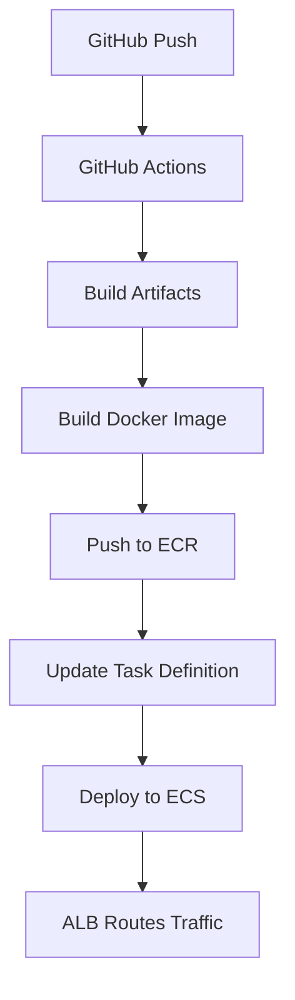

# 🚀 Appsmith ECS Fargate Deployment

Complete CI/CD pipeline for deploying Appsmith to AWS ECS Fargate using GitHub Actions.

## ✨ Features

- **Automated CI/CD** with GitHub Actions
- **Scalable Infrastructure** with AWS ECS Fargate
- **Load Balancing** with Application Load Balancer
- **Container Registry** with AWS ECR
- **Infrastructure as Code** with Terraform
- **Monitoring** with CloudWatch
- **Security** with VPC, Security Groups, and IAM

## 🎯 Quick Start

1. **Prerequisites Setup**
   ```bash
   # Install required tools
   brew install awscli terraform docker
   
   # Configure AWS
   aws configure
   ```

2. **Deploy Infrastructure**
   ```bash
   ./deploy-setup.sh
   ```

3. **Configure GitHub Secrets**
   - `AWS_ACCESS_KEY_ID`
   - `AWS_SECRET_ACCESS_KEY`

4. **Deploy Application**
   ```bash
   git push origin main
   ```

## 📊 Deployment Flow



## 🏗️ Infrastructure

| Component | Purpose | Configuration |
|-----------|---------|---------------|
| **VPC** | Network isolation | 10.0.0.0/16 with public/private subnets |
| **ECR** | Container registry | Vulnerability scanning enabled |
| **ECS** | Container orchestration | Fargate with auto-scaling |
| **ALB** | Load balancing | HTTP/HTTPS with health checks |
| **CloudWatch** | Monitoring | Logs and metrics collection |

## 🔧 Configuration Files

```
├── .github/workflows/deploy-to-ecs.yml    # CI/CD pipeline
├── .aws/task-definition.json              # ECS task configuration
├── terraform/main.tf                      # Infrastructure definition
├── docker-compose.yml                     # Local development
└── deploy-setup.sh                        # Automated setup
```

## 🔍 Monitoring

### Application URL
Your application will be available at: `http://<alb-dns-name>`

### CloudWatch Logs
```bash
aws logs tail /ecs/appsmith --follow
```

### ECS Service Status
```bash
aws ecs describe-services --cluster appsmith-cluster --services appsmith-service
```

## 🔄 Operations

### Scaling
```bash
# Scale up to 3 instances
aws ecs update-service --cluster appsmith-cluster --service appsmith-service --desired-count 3
```

### Updates
Push code changes to trigger automatic deployment via GitHub Actions.

### Rollback
```bash
# List revisions
aws ecs list-task-definitions --family-prefix appsmith-task

# Rollback to previous version
aws ecs update-service --cluster appsmith-cluster --service appsmith-service --task-definition appsmith-task:X
```

## 💡 Development

### Local Testing
```bash
# Run locally with Docker Compose
docker-compose up

# Access at http://localhost
```

### Environment Variables
Set these in your environment or GitHub secrets:

- `AWS_REGION`: AWS deployment region
- `ENVIRONMENT`: staging/production
- `APP_NAME`: Application name

## 🛡️ Security

- ✅ Private subnets for ECS tasks
- ✅ Security groups with minimal access
- ✅ IAM roles with least privilege
- ✅ ECR vulnerability scanning
- ✅ CloudWatch logging enabled

## 💰 Cost Estimation

**Staging Environment (1 task)**:
- Fargate: ~$30/month
- ALB: ~$16/month
- NAT Gateway: ~$32/month
- **Total**: ~$78/month

**Production Environment (3 tasks)**:
- Fargate: ~$90/month
- ALB: ~$16/month
- NAT Gateway: ~$64/month
- **Total**: ~$170/month

## 🆘 Troubleshooting

### Common Issues

1. **Task keeps stopping**
   - Check CloudWatch logs for errors
   - Verify health check endpoint
   - Check resource allocation

2. **Cannot access application**
   - Verify security group rules
   - Check ALB target group health
   - Confirm DNS resolution

3. **Build failures**
   - Check GitHub Actions logs
   - Verify AWS credentials
   - Ensure ECR repository exists

### Debug Commands

```bash
# Check ECS task status
aws ecs describe-tasks --cluster appsmith-cluster --tasks $(aws ecs list-tasks --cluster appsmith-cluster --service-name appsmith-service --query 'taskArns[0]' --output text)

# View recent logs
aws logs tail /ecs/appsmith --since 1h

# Check ALB target health
aws elbv2 describe-target-health --target-group-arn $(aws elbv2 describe-target-groups --names appsmith-tg --query 'TargetGroups[0].TargetGroupArn' --output text)
```

## 📚 Documentation

- [Complete Deployment Guide](./ECS_DEPLOYMENT.md)
- [AWS ECS Documentation](https://docs.aws.amazon.com/ecs/)
- [Appsmith Documentation](https://docs.appsmith.com/)

## 🤝 Contributing

1. Fork the repository
2. Create a feature branch
3. Make your changes
4. Test locally with `docker-compose up`
5. Submit a pull request

## 📄 License

This project is licensed under the same license as Appsmith.

---

**Need Help?** Check the [troubleshooting guide](./ECS_DEPLOYMENT.md#troubleshooting) or open an issue.
